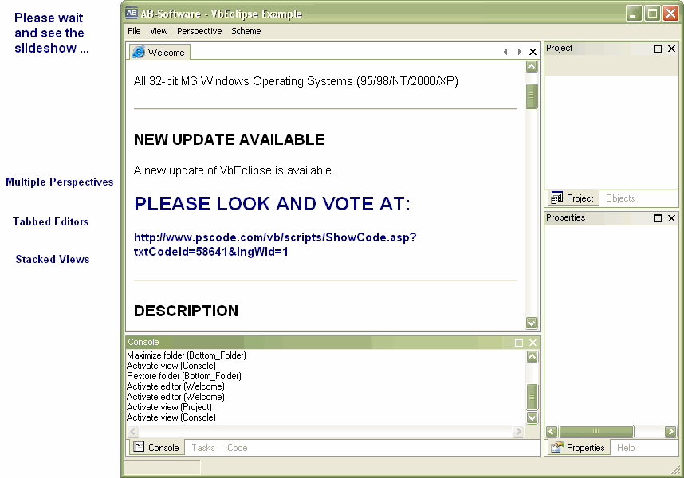



## VbEclipse \(docking MDI\) \- New Version 0\.8\.99

### Description

Version 0.8.99 of the VbEclipse project is available now. Please look at the screenshots. PLEASE VOTE AT http://www.pscode.com/vb/scripts/ShowCode.asp?txtCodeId=58641&lngWId=1.
 
### More Info
 

             |
---                |---
**Submitted On**   |
**By**             |[AB\-Software](https://github.com/Planet-Source-Code/PSCIndex/blob/master/ByAuthor/ab-software.md)
**Level**          |Advanced
**User Rating**    |5.0 (10 globes from 2 users)
**Compatibility**  |VB 6\.0
**Category**       |[Custom Controls/ Forms/  Menus](https://github.com/Planet-Source-Code/PSCIndex/blob/master/ByCategory/custom-controls-forms-menus__1-4.md)
**World**          |[Visual Basic](https://github.com/Planet-Source-Code/PSCIndex/blob/master/ByWorld/visual-basic.md)
**Archive File**   |

### Source Code

  <H1>AB-Software - VbEclipse Project</H1>
  
http://www.ab-software.com

  
Freeware Version 0.8.97

  
All 32-bit MS Windows Operating Systems
  (95/98/NT/2000/XP)

  

  <H2>NEW UPDATE AVAILABLE</H2>
  
A new update of VbEclipse is available.

  
<B>PLEASE LOOK AND VOTE
  AT:</B>

  
<B>http://www.pscode.com/vb/scripts/ShowCode.asp?txtCodeId=58641&amp;lngWId=1</B>

  

  <H2>DESCRIPTION</H2>
  
The VbEclipse project is a Visual Basic 6.0 implementation
  of the Eclipse perspectives. It provides a high flexible and
  complete configurable docking MDI solution with a nice user
  interface.

  
At work I'm developing Java with the open source Eclipse 3.0
  IDE (see www.eclipse.org). This IDE works with perspectives,
  which gives the developer different views on his source.

  
If the developer is simply coding Java, he will do this in
  the java perspective. This perspective has some views like
  project explorer, tasks, ... But if you are debugging the
  source, Eclipse switches to the debug perspective. Here you can
  see other views like breakpoints, variables or the running
  tasks.

  
The user will automaticlly see only the views he really
  needs for his current work. Cause I like this concept, I was
  inspired to implement this possibility for Visual Basic
  developers. And this is also the final goal for this
  project.

  
But you can do more with this Control than just create IDE
  apps. Just have a look at the "VbDoc" example in the download
  and see how simply it is to work with perspectives and which
  surplus values you get.

  
Thanks for your interest on my work.

  
PLEASE VOTE IF YOU LIKE IT :o)

  

  <H2>FEATURE HISTORY</H2>
  <H3>Version 0.3.x (December 2004)</H3>
  <TABLE class="summary">
   <TR>
    <TH width="1"><NOBR>+ / -</NOBR></TH>
    <TH width="25%"><NOBR>Feature / Bugfix</NOBR></TH>
    <TH width="100%">Description</TH>
   </TR>
   <TR>
    <TD>+</TD>
    <TD><B>Perspectives</B></TD>
    <TD>Different sets of layouted views (forms) to switch
    between different perspectives. Perspectives descripe the
    presentation of theire views.</TD>
   </TR>
   <TR>
    <TD>+</TD>
    <TD><B>Views</B></TD>
    <TD>Views are representing simple Visual Basic standard
    forms and could be accessed by a unique view id. Note thar
    there could only be one view instance visible on each
    perspective. When the user changes the perspective, no view
    will be unloaded. Only the position and the visibility of
    views will be changed. So if the user switches back to the
    first perspective the layout will not be lost or
    reset.</TD>
   </TR>
   <TR>
    <TD>+</TD>
    <TD><B>Folders</B></TD>
    <TD>Views are layouted on the perspective by folders. The
    sense of a folder is to provide the ability to show views
    stacked together with other views. There is only one view
    visible for each folder. The visible view could be canged
    by <B>tabs</B>.</TD>
   </TR>
   <TR>
    <TD>+</TD>
    <TD><B>View Handling</B></TD>
    <TD><B>Show</B>, <B>activate</B> and <B>close</B> views on
    the active perspective by theire id. You can also
    <B>maximize</B> and <B>restore</B> views / editors.</TD>
   </TR>
   <TR>
    <TD>+</TD>
    <TD><B>Drag &amp; Drop</B></TD>
    <TD>Drag a view while press and hold the left mouse button
    on views caption. If you hold the button a while (500 ms) a
    focus rectangle will appear. Now you can select an other
    folder to drop the view by releasing the mouse button. You
    can also create new folders if you drop the view on the
    top, left, bottom or right of a folder. The new folder will
    appear in the relation you drop the view.</TD>
   </TR>
   <TR>
    <TD>+</TD>
    <TD><B>Office 2003 Color Scheme</B></TD>
    <TD>This scheme has different color styles for
    <B>classic</B>, <B>metallic</B> (silver), <B>homestead</B>
    (olive) and <B>normal</B> (blue) mode.</TD>
   </TR>
  </TABLE>
  <H3>Version 0.8.33 (January 2005)</H3>
  <TABLE class="summary">
   <TR>
    <TH width="1"><NOBR>+ / -</NOBR></TH>
    <TH width="25%"><NOBR>Feature / Bugfix</NOBR></TH>
    <TH width="100%">Description</TH>
   </TR>
   <TR>
    <TD>+</TD>
    <TD><B>New Color Scheme</B></TD>
    <TD>New Windows XP Color Scheme as a replacement for the
    Office 2003 Color Scheme.</TD>
   </TR>
   <TR>
    <TD>+</TD>
    <TD><B>Custom Color Schemes</B></TD>
    <TD>Developers can set custom colors by <B>IScheme</B>
    interface.</TD>
   </TR>
   <TR>
    <TD>+</TD>
    <TD><B>Editors</B></TD>
    <TD>Open, Activate, Close</TD>
   </TR>
   <TR>
    <TD>+</TD>
    <TD><B>Folder Captions</B></TD>
    <TD>Folders now have a caption which shows the name of the
    open view.</TD>
   </TR>
   <TR>
    <TD>+</TD>
    <TD><B>Floating Windows</B></TD>
    <TD>If you drop a view to the outside of the perspective a
    floating window will apear.</TD>
   </TR>
   <TR>
    <TD>+</TD>
    <TD><B>Auto Hide Folder Tabs</B></TD>
    <TD>The folders tabs are invisible if there is only one
    view on it.</TD>
   </TR>
   <TR>
    <TD>+</TD>
    <TD><B>Tabs Orientation</B></TD>
    <TD>
     For better distinguish between folders and the editor
     area the following tab orientation were set:
     <UL>
      <LI>The orientation of the folder tabs changed to
      bottom orientation.</LI>
      <LI>The orientation of the editor area tabs changed to
      top orientation.</LI>
     </UL>
    </TD>
   </TR>
   <TR>
    <TD>+</TD>
    <TD><B>Editor Tabs Orientation</B></TD>
    <TD>The orientation of the editor area tabs changed to top
    orientation.</TD>
   </TR>
   <TR>
    <TD>-</TD>
    <TD><B>Flicker effects</B></TD>
    <TD>I reduced the flickering on resize a perspective by a
    new rendering method.</TD>
   </TR>
   <TR>
    <TD>-</TD>
    <TD><B>Performence</B></TD>
    <TD>Optimized Performence on layouting perspectives.</TD>
   </TR>
   <TR>
    <TD>-</TD>
    <TD><B>Folders</B></TD>
    <TD>Refresh Layout after remove a maximized folder
    (fixed).</TD>
   </TR>
   <TR>
    <TD>-</TD>
    <TD><B>ShowView() Methode</B></TD>
    <TD>ShowView creates a new folder if perspective has none
    (fixed).</TD>
   </TR>
  </TABLE>
  <H3>Version 0.8.91 (30. January 2004)</H3>
  <TABLE class="summary">
   <TR>
    <TH width="1"><NOBR>+ / -</NOBR></TH>
    <TH width="25%"><NOBR>Feature / Bugfix</NOBR></TH>
    <TH width="100%">Description</TH>
   </TR>
   <TR>
    <TD>+</TD>
    <TD><B>Folder Caption</B></TD>
    <TD>New buttons on folder caption to maximize / restore the
    folder and to close a view.</TD>
   </TR>
  </TABLE>
  <H3>Version 0.8.92 (31st January 2005)</H3>
  <TABLE class="summary">
   <TR>
    <TH width="1"><NOBR>+ / -</NOBR></TH>
    <TH width="25%"><NOBR>Feature / Bugfix</NOBR></TH>
    <TH width="100%">Description</TH>
   </TR>
   <TR>
    <TD>+</TD>
    <TD><B>Folder Caption</B></TD>
    <TD>Caption button became a hover and pressed style
    effect.</TD>
   </TR>
   <TR>
    <TD>+</TD>
    <TD><B>Tabs Navigation</B></TD>
    <TD>Tabs now have navigation buttons (show previous and
    next view). The editor area tabs also got a close editor
    button.</TD>
   </TR>
   <TR>
    <TD>+</TD>
    <TD><B>Editor Navigation</B></TD>
    <TD>New perspective methods: NextEditor() +
    PrevEditor()</TD>
   </TR>
   <TR>
    <TD>+</TD>
    <TD><B>Floating windows</B></TD>
    <TD>Set the main window as the new owner of floating
    windows.</TD>
   </TR>
  </TABLE>
  <H3>Version 0.8.94</H3>
  <TABLE class="summary">
   <TR>
    <TH width="1"><NOBR>+ / -</NOBR></TH>
    <TH width="25%"><NOBR>Feature / Bugfix</NOBR></TH>
    <TH width="100%">Description</TH>
   </TR>
   <TR>
    <TD>-</TD>
    <TD><B>Floating windows</B></TD>
    <TD>If you move floating windows to mouse cursor doesn't
    position at the middle of the folder caption anymore.</TD>
   </TR>
  </TABLE>
  <H3>Version 0.8.95 (1st February 2005)</H3>
  <TABLE class="summary">
   <TR>
    <TH width="1"><NOBR>+ / -</NOBR></TH>
    <TH width="25%"><NOBR>Feature / Bugfix</NOBR></TH>
    <TH width="100%">Description</TH>
   </TR>
   <TR>
    <TD>+</TD>
    <TD><B>Tab Navigation</B></TD>
    <TD>Auto hide and disable tab navigation buttons</TD>
   </TR>
   <TR>
    <TD>-</TD>
    <TD><B>Color Scheme</B></TD>
    <TD>Fixed classic window style.</TD>
   </TR>
  </TABLE>
  <H3>Version 0.8.96 (2nd February 2005)</H3>
  <TABLE class="summary">
   <TR>
    <TH width="1"><NOBR>+ / -</NOBR></TH>
    <TH width="25%"><NOBR>Feature / Bugfix</NOBR></TH>
    <TH width="100%">Description</TH>
   </TR>
   <TR>
    <TD>-</TD>
    <TD><B>Floating Windows</B></TD>
    <TD>Fixed floating windows bug on closing a perspective and
    open it again.</TD>
   </TR>
   <TR>
    <TD>+</TD>
    <TD><B>Perspective Layout</B></TD>
    <TD>Set folders as floating windows at application
    startup.</TD>
   </TR>
   <TR>
    <TD>+</TD>
    <TD><B>Floating Windows</B></TD>
    <TD>Drop multiple views on a floating window.</TD>
   </TR>
   <TR>
    <TD>+</TD>
    <TD><B>VbDoc example</B></TD>
    <TD>New example application "VbDoc" (creates a html
    documentation of your Visual Basic 6.0 projects).</TD>
   </TR>
  </TABLE>
  <H3>Version 0.8.97 (4th February 2005)</H3>
  <TABLE class="summary">
   <TR>
    <TH width="1"><NOBR>+ / -</NOBR></TH>
    <TH width="25%"><NOBR>Feature / Bugfix</NOBR></TH>
    <TH width="100%">Description</TH>
   </TR>
   <TR>
    <TD>-</TD>
    <TD><B>Perspective Layout</B></TD>
    <TD>Fixed a bug on switching between perspectives when a view is maximized.</TD>
   </TR>
   <TR>
    <TD>+</TD>
    <TD><B>Color Schemes</B></TD>
    <TD>New perspective property <b>ColorScheme</b> to select a color scheme (Windows XP, Office 2003, Custom).</TD>
   </TR>
   <TR>
    <TD>+</TD>
    <TD><B>Custom Scheme</B></TD>
    <TD>You can define colors for the custom scheme with different properties in Visual Basic IDE.</TD>
   </TR>
  </TABLE>
  <H3>Version 0.8.98 (7th February 2005)</H3>
  <TABLE class="summary">
   <TR>
    <TH width="1"><NOBR>+ / -</NOBR></TH>
    <TH width="25%"><NOBR>Feature / Bugfix</NOBR></TH>
    <TH width="100%">Description</TH>
   </TR>
   <TR>
    <TD>+</TD>
    <TD><B>Perspective</B></TD>
    <TD>I made the perspective control alignable so you are able to drop it on a MDI form.</TD>
   </TR>
   <TR>
    <TD>+</TD>
    <TD><B>Caption Buttons</B></TD>
    <TD>Caption buttons are drawn like the caption gradients.</TD>
   </TR>
   <TR>
    <TD>-</TD>
    <TD><B>View Caption</B></TD>
    <TD>I have fixed the <b>ShowViewCaptions</b> perspective property. Now the view caption
	  won't be displayed if you set this property to <b>false</b>. But the views are
      still dragable. Just drag it by its tab or double click on a tab to maximize /
	  restore the view. If caption buttons are hidden the view navigation is displayed
	  to close a view.</TD>
   </TR>
   <TR>
    <TD>+</TD>
    <TD><B>View Caption</B></TD>
    <TD>I renamed the <b>ShowViewCaptions</b> perspective property to <b>ViewCaptions</b>.</TD>
   </TR>
   <TR>
    <TD>+</TD>
    <TD><B>View Caption Icon</B></TD>
    <TD>I have implemented a new property <b>ViewCaptionIcons</b> to show or hide an icon on
      the left side of the caption.</TD>
   </TR>
   <TR>
    <TD>-</TD>
    <TD><B>Floating Windows</B></TD>
    <TD>Floating windows can float over it self and a floating rect will be drawn if you
      drag a view to the middle of the editor area.</TD>
   </TR>
  </TABLE>
   
  <H3>Version 0.8.99 (11th February 2005)</H3>
  <TABLE class="summary">
   <TR>
    <TH width="1"><NOBR>+ / -</NOBR></TH>
    <TH width="25%"><NOBR>Feature / Bugfix</NOBR></TH>
    <TH width="100%">Description</TH>
   </TR>
   <TR>
    <TD>+</TD>
    <TD><B>Folders</B></TD>
    <TD>You can define an active view for each folder.</TD>
   </TR>
   <TR>
    <TD>-</TD>
    <TD><B>Folders</B></TD>
    <TD>The active view of a folder will be stored if you switch to an other
 	  perspective and come back to the first perspective.</TD>
   </TR>
   <TR>
    <TD>+</TD>
    <TD><B>View Caption</B></TD>
    <TD>Double click the views caption to undock a view and make it a floating window.</TD>
   </TR>
   <TR>
    <TD>-</TD>
    <TD><B>Splitter Bars</B></TD>
    <TD>If you move the main window without to resize it, the drag and drop of the
	splitter bars were drawn wrong. I have fixed this bug.</TD>
   </TR>
   <TR>
    <TD>+</TD>
    <TD><B>Comments</B></TD>
    <TD>I add more comments to describe the methods, but still not all.</TD>
   </TR>
  </TABLE>

